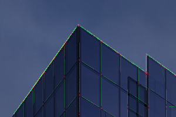
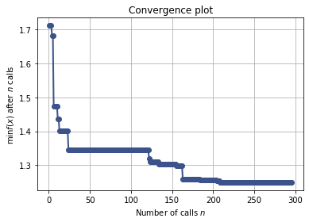
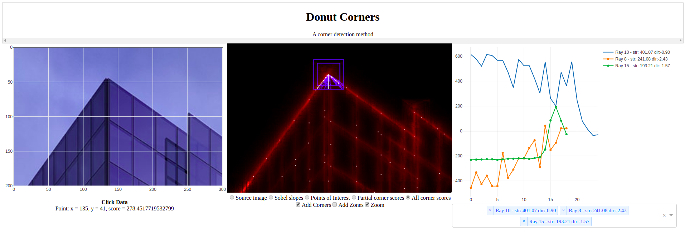
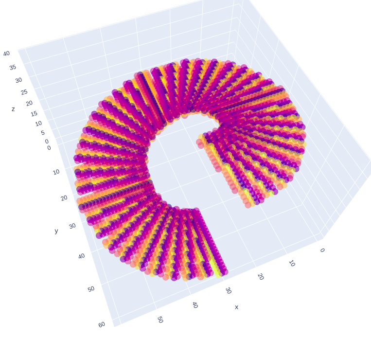

# Donut Corners
### Darrel Belvin



An experimental corner detection method utilizing a multi-layer kernel.

## Table of Contents
1. [Background](#Background)
1. [Method Evolution](#MethodEvolution)
1. [Sci-Kit Integration](#Sci-KitIntegration)
1. [Visualization Methods](#VisualizationMethods)
1. [Example Images](#ExampleImages)

## Background
Let's go backwards:
- I want to teach computers to recognize the shape of objects and rooms and such so they can interact with our world easier.
- I envision a computer vision algorithm that can quickly process an image into a low poly model of the objects and environment in that image.
- That low poly model will be made up of faces bounded by vertices and edges and could be created based off of the location of corners in the image and the directions of the edges coming out of those corners.
- As a baby step in that direction I decided to make a method that detects corners and edge directions associated with those corners.

## Method Evolution
From the beginning my method has consisted of
1. A scoring function that takes in pixel coordinates and outputs a score related to the probability that that pixel is a corner, and
2. Some method of finding local maxima of the scoring function

### Scoring Function Evolution
1. Initial Attempt
    - Sobel X & Y
    - Peaks as points of interest
    - Find points of interest in ring around point
    - Make rays from peaks to point
    - Take the component of the sobel perpendicular to array along ray length
    - Average that component for all rays and return as score
2. Pre-baked sobel angles in every direction
3. Replace rays with multi-layer kernel on sobel
4. Change kernel shape and apply to original image to remove pre-baking

### Optimization Function Evolution
1. Crappy home-made gradient descent
2. Use scipy.optimize's Nelder-Mead with early stopping
3. Made a quantized simplex descent algorithm
4. Added Basin Mapping to find all local maxima and not repeat searches
5. Made an edge-following optimizer

## Sci-Kit Integration

Donut Corners is able to be used as a transformer in sci-kit learn pipelines. This required the implementation of:
- fit(X, y)
    - doesn't do anything. Donut Corners doesn't have any parameters that could be fit to a dataset.
- transform(X, img_shape = None)
    - runs corner detection and appends results as new columns
    - requires either image_shape passed as a parameter or for the img_shape property to be set on the object
    - if engineered_only is passed or set on object, corner result featured are returned by themselves
- set_params(**kwargs)
    - allows hyperparameter optimizers to modify parameters in-between runs

The result is that the following code runs as expected:
```py
pipe = Pipeline([
    ('corners', DonutCorners(**dc_kwargs)),
    ('model', SomeModel())
])

searcher = GridSearchCV(pipe,
    # Search space specification 
)

searcher.fit(X_train, y_train)
```

#### I actually did this:
Using a bayseian search, I optimized DonutCorner's hyperparameters on the MNIST handwritten images dataset and a SVC model looking at only the engineered features.<br>
It converged nicely like this:


- log-loss validation score: 1.25
- Best parameters:
    - corners__fork_spread = 4.0
    - corners__beam_width = 4.04
    - corners__beam_length = 6.17
    - corners__beam_start = 0.86
    - corners__angle_count = 12

## Visualization Methods

### Interactive Demo for the First Iteration
There is an awesome interactive demo for an early version of Donut Corners. Here's how to run it
```
git checkout early-presentation
python donut_dash.py
```


I have plans to make something similar for the current iteration, that has not happened yet though.

### Results Visualization

There is one method used to visualize the results of Donut Corners
```py
paint_corners(img, dc: DonutCorners)
    """
    Combine the results of a Donut Corners object with a given image. 
  
    This will add a white dot at each corner location with brightness dependant on the corner score and green lines along the top rays with brightness dependant on the ray score.
  
    Parameters: 
    img (ndarray): The image to be added to

    dc (DonutCorners): A donut Corners object
  
    Returns: 
    img (ndarray): The resulting image
    """
```

### Kernel Visualization
I made a method to visualize my kernel, here's an example of a kernel:


# Example Images
- [Example 1a](https://raw.githubusercontent.com/darrelbelvin/donut-corners/forked_beam/figures/bldg-1_all.png)
- [Example 1b](https://raw.githubusercontent.com/darrelbelvin/donut-corners/forked_beam/figures/bldg-1_scores_corners.png)
- [Example 1c](https://raw.githubusercontent.com/darrelbelvin/donut-corners/forked_beam/figures/bldg-1_scores_only.png)
- [Example 2a](https://raw.githubusercontent.com/darrelbelvin/donut-corners/forked_beam/figures/bldg-2_all.png)
- [Example 2b](https://raw.githubusercontent.com/darrelbelvin/donut-corners/forked_beam/figures/bldg-2_scores_corners.png)
- [Example 2c](https://raw.githubusercontent.com/darrelbelvin/donut-corners/forked_beam/figures/bldg-2_scores_only.png)
- [Example 3a](https://raw.githubusercontent.com/darrelbelvin/donut-corners/forked_beam/figures/bldg-3_all.png)
- [Example 3b](https://raw.githubusercontent.com/darrelbelvin/donut-corners/forked_beam/figures/bldg-3_scores_corners.png)
- [Example 3c](https://raw.githubusercontent.com/darrelbelvin/donut-corners/forked_beam/figures/bldg-3_scores_only.png)
- [Example 4a](https://raw.githubusercontent.com/darrelbelvin/donut-corners/forked_beam/figures/bldg-4_all.png)
- [Example 4b](https://raw.githubusercontent.com/darrelbelvin/donut-corners/forked_beam/figures/bldg-4_scores_corners.png)
- [Example 4c](https://raw.githubusercontent.com/darrelbelvin/donut-corners/forked_beam/figures/bldg-4_scores_only.png)
- [Example 5a](https://raw.githubusercontent.com/darrelbelvin/donut-corners/forked_beam/figures/bldg-5_all.png)
- [Example 5b](https://raw.githubusercontent.com/darrelbelvin/donut-corners/forked_beam/figures/bldg-5_scores_corners.png)
- [Example 5c](https://raw.githubusercontent.com/darrelbelvin/donut-corners/forked_beam/figures/bldg-5_scores_only.png)
- [Example 6a](https://raw.githubusercontent.com/darrelbelvin/donut-corners/forked_beam/figures/bldg-6_all.png)
- [Example 6b](https://raw.githubusercontent.com/darrelbelvin/donut-corners/forked_beam/figures/bldg-6_scores_corners.png)
- [Example 6c](https://raw.githubusercontent.com/darrelbelvin/donut-corners/forked_beam/figures/bldg-6_scores_only.png)
- [Example 7a](https://raw.githubusercontent.com/darrelbelvin/donut-corners/forked_beam/figures/bldg-7_all.png)
- [Example 7b](https://raw.githubusercontent.com/darrelbelvin/donut-corners/forked_beam/figures/bldg-7_scores_corners.png)
- [Example 7c](https://raw.githubusercontent.com/darrelbelvin/donut-corners/forked_beam/figures/bldg-7_scores_only.png)
- [Example 8a](https://raw.githubusercontent.com/darrelbelvin/donut-corners/forked_beam/figures/bldg-8_all.png)
- [Example 8b](https://raw.githubusercontent.com/darrelbelvin/donut-corners/forked_beam/figures/bldg-8_scores_corners.png)
- [Example 8c](https://raw.githubusercontent.com/darrelbelvin/donut-corners/forked_beam/figures/bldg-8_scores_only.png)
- [Example 9a](https://raw.githubusercontent.com/darrelbelvin/donut-corners/forked_beam/figures/bldg-9_all.png)
- [Example 9b](https://raw.githubusercontent.com/darrelbelvin/donut-corners/forked_beam/figures/bldg-9_scores_corners.png)
- [Example 9c](https://raw.githubusercontent.com/darrelbelvin/donut-corners/forked_beam/figures/bldg-9_scores_only.png)